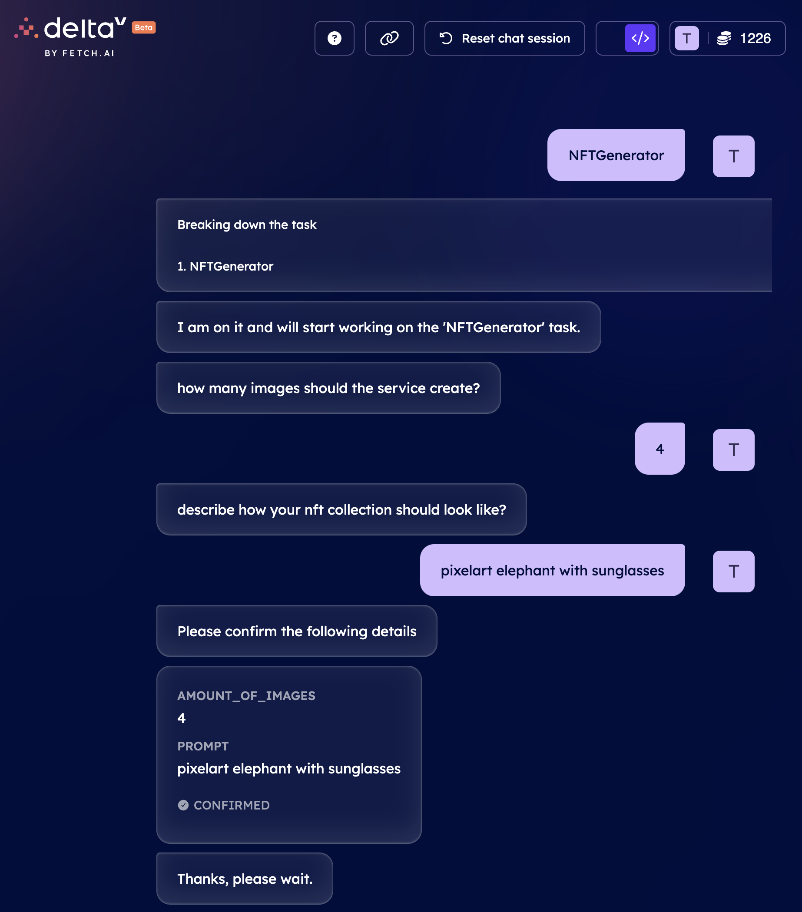
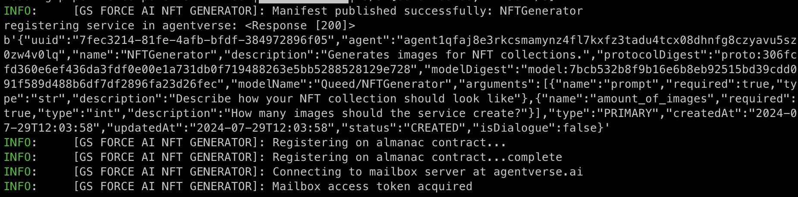

# GS Node AI with Fetch.ai (PoC) - Image generation

A model using Stable Diffusion locally, generating images based on the user prompt and posting them on AWS S3 with a link in the response to the user

Please keep in mind that this agent is **hosted locally**, so is available only when host is online and agent is running.

## How to run

1. Clone the repository
2. `cd fetchai_agent_for_nft`
3. `poetry shell`
4. `python3 image_generating_agent.py`

## Used technology stack

- [uagents](https://pypi.org/project/uagents/) from [Fetch.ai](https://fetch.ai/docs/concepts/agents/agents),
- [Agentverse](https://agentverse.ai/),
- [DeltaV](https://deltav.agentverse.ai/chat?objective=GS%20Force%20AI&serviceGroup=34afd1b8-387d-45e2-833c-7f76a08209d6&personality=talkative-01)

## Screenshots

### DeltaV interface

### Command line on local machine

